# 🐧 Palmer Penguins EDA 리포트

## 프로젝트 개요
- **분석 목적**: 펭귄의 다양한 생물학적 특성(부리 길이, 날개 길이 등)을 분석하고, 이를 바탕으로 종(species)을 분류할 수 있는지 확인
- **데이터 출처**: Palmer Penguins 데이터셋 (https://allisonhorst.github.io/palmerpenguins/)
- **데이터 구성**: 6개의 주요 특성과 종(species), 성별(sex), 서식지(island) 등으로 구성된 총 344개 샘플
- **분석 단위**: 개별 펭귄

- Adelie 펭귄

- Chinstrap 펭귄  

- Gentoo 펭귄

---

## 01. 데이터 수집 및 로드

---

## 02. 데이터 구조 및 변수 이해
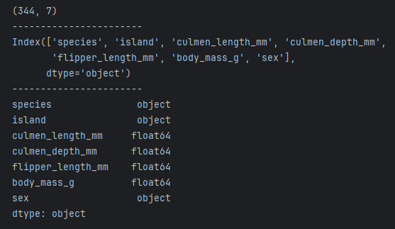
- 344행 7열

| Column Name         | Description |
|---------------------|-------------|
| species             | 종           |
| island              | 서식지(섬)      |
| culmen_length_mm    | 부리 길이       |
| culmen_depth_mm     | 부리 깊이       |
| flipper_length_mm   | 날개 길이       |
| body_mass_g         | 몸무게         |
| sex                 | 성별          |

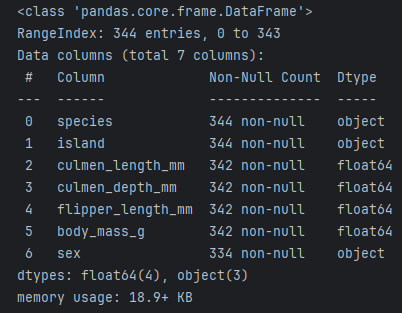

- 중복값 없음

- 범주형 데이터

---

## 03. 데이터 요약 및 기술 통계
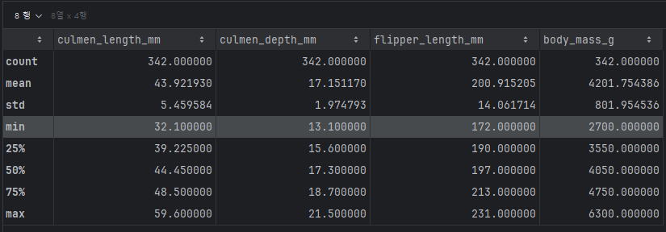
- 수치형 변수(bill_length_mm, flipper_length_mm 등)의 기본 통계 확인

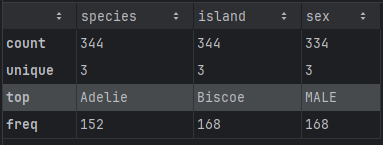
- object형 데이터

---

## 04. 결측치, 이상치 탐지
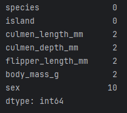
- 결측치 존재

### species 별 수치형 변수 분포

- 일부 수치형 변수에서 이상치 존재하나 큰 영향은 없음

---

## 05. 데이터 전처리

- '.' 값을 NaN으로 변경

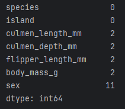

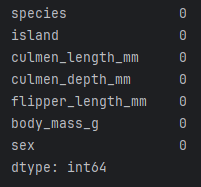
- 총 344개 샘플 중 11개 행에 결측치가 존재(전체의 약 3.2%)
- 해당 행은 분석에 큰 영향을 주지 않는다고 판단되어 제거 처리

---

## 06. 변수분포 시각화

- 펭귄종 비율
- 종별(species) 분포는 Adelie > Gentoo > Chinstrap 순으로 불균형함

- 서식섬 비율

- 성별 비율

- 펭귄종별 서식하는 섬

- 펭귄종별 성별 수

---

## 07. 변수 간 관계 시각화

- pairplot으로 모든 수치형 데이터 간 관계를 한 번에 확인
- 종별로 체중(body_mass_g), 부리 길이(bill_length_mm), 날개 길이(flipper_length_mm) 등이 유의미한 차이를 보임

- 부리길이 vs 부리깊이
- Adelie 종은 부리 길이가 짧고 부리 깊이가 깊은 경향
- Gentoo는 날개 길이와 체중이 상대적으로 큰 경향

- 날개 길이 vs 몸무게

---

## 08. 상관관계 및 교차분석

- 상관관계 분석

- `flipper_length_mm`와 `body_mass_g`는 **상관계수 0.87**로 매우 강한 양의 상관관계
- `culmen_length_mm`와 `culmen_depth_mm`은 **상관계수 -0.23**으로 약한 음의 상관관계
- `culmen_length_mm`와 `flipper_length_mm`는 **0.65**로 높은 양의 상관관계

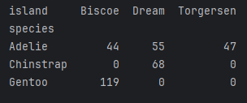
- 펭귄 종별 서식 섬 교차표 (범주형)

---

## 09. Feature Engineering
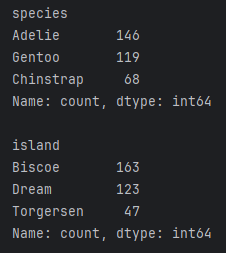

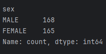
- 문자형 -> 수치형 변경

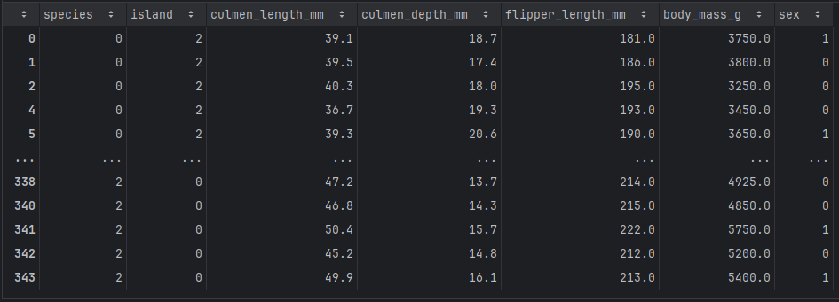

---

## 10. 최종요약/인사이트 도출
- flipper_length_mm, culmen_length_mm, body_mass_g 조합으로 종별 경계가 비교적 뚜렷
- Adelie, Gentoo, Chinstrap 펭귄은 생물학적 특성에서 확실한 차이를 보임
- 주요 상관관계 수치 요약:
  - `flipper_length_mm` ↔ `body_mass_g`: **0.87**
  - `culmen_length_mm` ↔ `body_mass_g`: **0.59**
  - `culmen_length_mm` ↔ `flipper_length_mm`: **0.65**
  - `culmen_length_mm` ↔ `culmen_depth_mm`: **-0.23**

- 부리 길이, 체중, 날개 길이는 종 분류에 가장 중요한 변수로 활용 가능
- 간단한 로지스틱 회귀로도 높은 정확도로 종 분류 가능함

---

## 11. 머신러닝 - 펭귄의 종 분류 예측 (Logistic Regression)
- 펭귄의 신체 특징(부리 길이, 깊이, 날개 길이, 몸무게 등)을 기반으로 `species(종)`을 예측하는 분류 모델을 구현한다.
- Logistic Regression을 활용한 다중 분류 작업을 진행하며, 전처리로는 표준화와 결측치 보정을 포함한다.

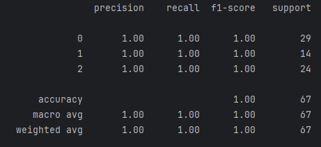
- 분류 모델: **Logistic Regression**
- 정확도: `100%`
- 분류 리포트: precision, recall, f1-score를 통해 각 종별 분류 성능 확인

### 📌정확도

- 데이터 내 클래스 간 차이가 명확
- 특성 간 중복도가 낮아 Logistic Regression만으로도 높은 분류 성능 보임

---
## 🔍 향후 활동 가능성
**1. 다른 머신러닝 모델도 실험해보기**

이번에는 로지스틱 회귀를 사용했지만, 랜덤 포레스트나 KNN 같은 다른 모델을 사용해 보면 어떤 모델이 더 잘 맞는지 비교 가능

**2. 더 많은 데이터로 분석 확대**

시간이 지나면서 추가로 수집된 펭귄 데이터를 활용하면 더 정교한 분석이 가능하고, 변화 추이도 살펴볼 수 있음

**3. 펭귄 종 말고 다른 분류에도 적용해보기**

펭귄의 성별이나 서식 섬을 예측하는 모델로 확장해 보면 분류 모델을 더 다양하게 활용 가능
